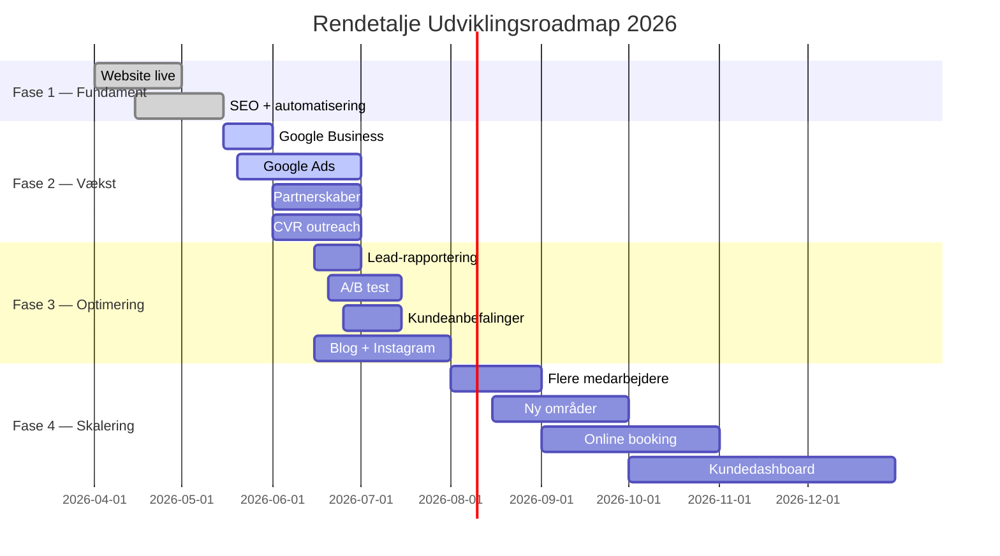

# Rendetalje — Udviklingsroadmap

> *Opdateret: Maj 2026 · Næste review: 1. juni 2026*

---

## Fase 1: Fundament ✅ *(April — Maj 2026)*

Grundlaget er på plads. Hjemmesiden er live, kontaktflowet kører, SEO-fundamentet er lagt, og de første automatiseringer er i drift.

| Opgave | Status | Dato |
|--------|--------|------|
| ✅ Hjemmeside live på rendetalje.dk | ✅ Færdig | April 2026 |
| ✅ Kontaktformular → email via Resend | ✅ Færdig | April 2026 |
| ✅ SEO grundlag (title, canonical, OG, schema) | ✅ Færdig | April 2026 |
| ✅ Prisstigning 349→399 kr/time | ✅ Færdig | April 2026 |
| ✅ Prisberegner + fastpris-pakker | ✅ Færdig | April 2026 |
| ✅ Mobil CTA + sticky phone | ✅ Færdig | April 2026 |
| ✅ Automatisk lead-scan (cron) | ✅ Færdig | Maj 2026 |
| ✅ Auto-svar på kontaktformular | ✅ Færdig | Maj 2026 |

### Leverancer i Fase 1

- **16 routes** på rendetalje.dk (marketing, services, guides, juridiske)
- **Prisberegner** på /priser med live estimering (timepris × m²)
- **3 cron-jobs**: lead-scan (dagligt), reaktivering (ugentligt), DBA-scan (ugentligt)
- **Struktureret data**: BreadcrumbList, Service, LocalBusiness (JSON-LD)
- **Sitemap + robots.txt + security headers** (CSP, HSTS)
- **Multi-step kontaktformular** med 4 trin og success-animation
- **Henvisningsprogram** på forsiden (200 kr rabat pr. henvist)

---

## Fase 2: Vækst 🔄 *(Maj — Juni 2026)*

Fokus på synlighed og kundetilgang. Eksterne kanaler aktiveres, og de første partnerskaber etableres.

| Opgave | Estimeret | Ansvarlig | Prioritet |
|--------|-----------|-----------|-----------|
| 🔲 Google Business Profile oprettet | Uge 20-21 | Jonas | 🔴 Høj |
| 🔲 Google Ads genstartet (budget 5.000 kr/mdr) | Uge 21-22 | Jonas | 🔴 Høj |
| 🔲 Trustpilot-profil med 5+ anmeldelser | Uge 21-24 | Jonas | 🟡 Medium |
| 🔲 Ejendomsmægler-partnerskaber (3+ kontorer) | Uge 22-25 | Jonas | 🟡 Medium |
| 🔲 3+ kommercielle kunder fra CVR leads | Uge 22-26 | Jonas | 🟡 Medium |

### Detaljer — Fase 2

#### Google Business Profile
- Opret og verificer profil for Rendetalje.dk ApS
- Udfyld alle felter (åbningstider, services, områder, billeder)
- Indsaml 5+ anmeldelser via opfølgende mails
- Post ugentlige opdateringer

#### Google Ads
- Genstart med budget på 5.000 kr/måned
- Målret "rengøring Aarhus", "flytterengøring Aarhus"
- Brug call-to-action tracking (telefonklik + formular)
- Mål: 10+ leads/mdr fra Ads

#### Ejendomsmægler-partnerskaber
- Outreach til 17 ejendomsmæglere (se [`EJENDOMSMAGGLERE.md`](./EJENDOMSMAGGLERE.md))
- Tilbyd rabatordning for mægleres kunder
- Mål: 3 aktive partnerskaber

#### Kommercielle CVR-leads
- 14 hot leads identificeret (se [`CVR_LEADS.txt`](./CVR_LEADS.txt))
- Telefonisk og mail-outreach
- Mål: 3+ aftaler om erhvervsrengøring

---

## Fase 3: Optimering *(Juni — Juli 2026)*

Når leads strømmer ind, optimeres konverteringsvejen og indholdet.

| Opgave | Estimeret | Prioritet |
|--------|-----------|-----------|
| 🔲 Ugentlig lead-rapport med konverteringsdata | Uge 24-25 | 🔴 Høj |
| 🔲 A/B test af pris-sider | Uge 25-26 | 🟡 Medium |
| 🔲 Kundeanbefalinger på hjemmesiden | Uge 26-27 | 🟡 Medium |
| 🔲 Blog med rengøringsguides | Uge 24-28 | 🟢 Lav |
| 🔲 Instagram-opslag (1/uge) | Uge 24+ | 🟢 Lav |

### Detaljer — Fase 3

#### Lead-rapportering
- Opsæt ugentlig rapport der viser:
  - Antal leads (formular + telefon)
  - Konverteringsrate (lead → booking)
  - Gennemsnitlig ordreværdi
  - Lead-kilde (organisk, Ads, henvisning, andet)

#### A/B test af prissider
- Test "timepris først" vs. "fastpris-pakker først"
- Test CTA-tekst og -placering
- Mål: +5% konverteringsrate

#### Kundeanbefalinger
- Indhent tilladelse fra 5+ tilfredse kunder
- Placer testimonials på forsiden og servicesider
- Format: navn + billede (med tilladelse) + kort udtalelse

#### Blog / guides
- Rengøringsguides (fx "Sådan består du dit flyttesyn" — allerede live)
- Yderligere emner: rengøringstips, årstidsguides, køberråd
- Kategoriseret under `/guides/` stien

#### Instagram
- 1 opslag/uge med før/efter-billeder
- Lokal hashtag-strategi (#rengøringaarhus, #flytterengøring)
- Stories med tips og behind-the-scenes

---

## Fase 4: Skalering *(August 2026+)*

Når basen er solid — flere medarbejdere, flere områder, mere automatisering.

| Opgave | Estimeret | Prioritet |
|--------|-----------|-----------|
| 🔲 Flere medarbejdere | August 2026+ | 🔴 Høj |
| 🔲 Udvidelse til flere områder | August 2026+ | 🟡 Medium |
| 🔲 Direkte online booking | September 2026+ | 🟡 Medium |
| 🔲 Kundedashboard / app | Q4 2026 | 🟢 Lav |

### Detaljer — Fase 4

#### Medarbejdere
- Ansæt 1-2 rengøringsassistenter (deltid/fast)
- Intro-program med kvalitetsstandarder
- Forsikring og ansættelseskontrakt på plads

#### Områdeudvidelse
- Næste områder: Skanderborg, Lystrup, Løgten, Tranbjerg
- Landingsside for hvert nyt område
- Målrettet lokal SEO

#### Online booking
- Kalenderintegration (Caledar eller Cal.com)
- Direkte bookingflow: vælg service → vælg tid → betal → bekræft
- Automatisk reminder (SMS/email)

#### Kundedashboard
- Login for eksisterende kunder
- Se kommende bookinger, historik, fakturaer
- Anmod om ekstra services
- App (PWA eller native) overvejes senere

---

## Tidslinje — Overblik

---

## Afhængigheder & risici

| Afhængighed | Blokerer for | Noter |
|-------------|-------------|-------|
| Google Business verificering | Lokal SEO, Google Ads | Kræver fysisk post til CVR-adresse |
| Trustpilot-anmeldelser | Social proof på hjemmesiden | Skal være organiske eller invitationsbaseret |
| Medarbejderkapacitet | Flere opgaver, udvidelse | Timing afhænger af efterspørgsel |
| Budget (Google Ads) | Synlighed | 5.000 kr/mdr er testbudget — evaluer efter 2 mdr |

---

## Tidligere milepæle

| Dato | Milepæl |
|------|---------|
| April 2026 | rendetalje.dk lanceret |
| April 2026 | Prisstigning 349→399 kr/time |
| April 2026 | Prisberegner + fastpris-pakker live |
| Maj 2026 | Automatisk lead-scan + auto-svar implementeret |
| Maj 2026 | CVR-leads indsamlet (14 leads) |
| Maj 2026 | Ejendomsmægler-outreach-plan klar (17 kontorer) |

---

*Rendetalje.dk ApS · CVR 45564096 · Gammel Viborgvej 40, 8381 Tilst*
